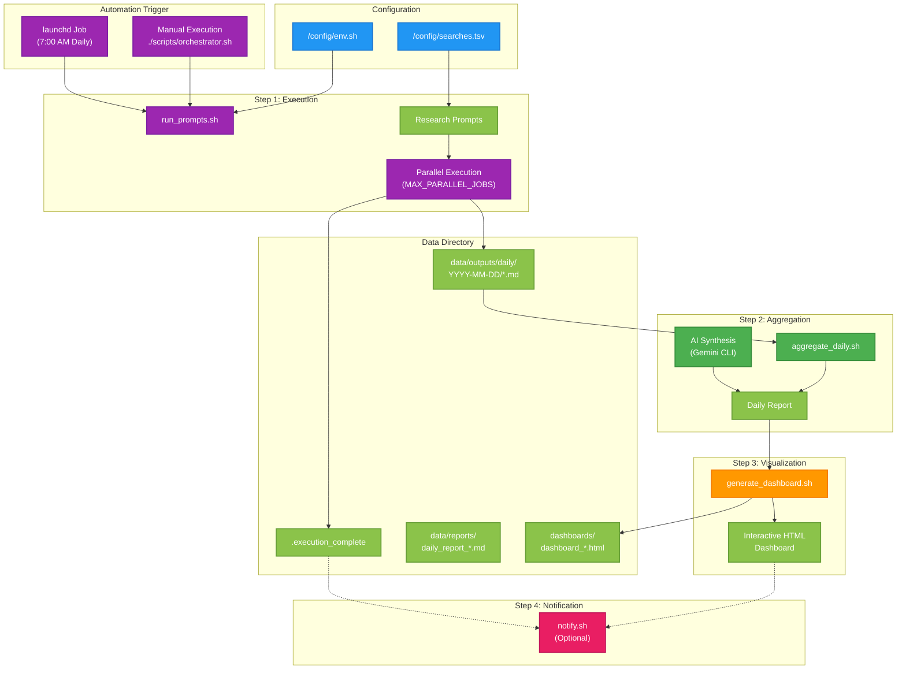

# NeuroHelix Pipeline Flow

## Overview
This diagram illustrates the complete NeuroHelix automated research and ideation pipeline, showing how it processes daily research cycles from prompt execution through dashboard generation and optional notifications.

## Diagram

## Key Components

### Configuration
- `config/env.sh`: Environment variables, settings, and paths
- `config/searches.tsv`: Research prompts with domains, priorities, and enabled status

### Execution Layer
- `scripts/executors/run_prompts.sh`: Main prompt execution engine
- Parallel execution of enabled prompts from searches.tsv
- Outputs stored as Markdown files by date

### Aggregation Layer
- `scripts/aggregators/aggregate_daily.sh`: Results synthesizer
- Combines all domain outputs into unified report
- AI-powered cross-domain analysis using Gemini CLI

### Visualization Layer
- `scripts/renderers/generate_dashboard.sh`: Dashboard generator
- Creates interactive HTML dashboard
- Links to latest version for easy access

### Notification Layer (Optional)
- `scripts/notifiers/notify.sh`: Optional notifications
- Can be configured for email or Discord
- Disabled by default (ENABLE_NOTIFICATIONS=false)

## Related Files
- `/scripts/orchestrator.sh`: Main pipeline coordinator
- `/launchd/com.neurohelix.daily.plist`: Automation configuration
- `/config/env.sh`: Environment and settings
- `/config/searches.tsv`: Research prompt definitions
- `/scripts/executors/run_prompts.sh`: Prompt execution engine
- `/scripts/aggregators/aggregate_daily.sh`: Results synthesizer
- `/scripts/renderers/generate_dashboard.sh`: Dashboard generator
- `/scripts/notifiers/notify.sh`: Notification sender
