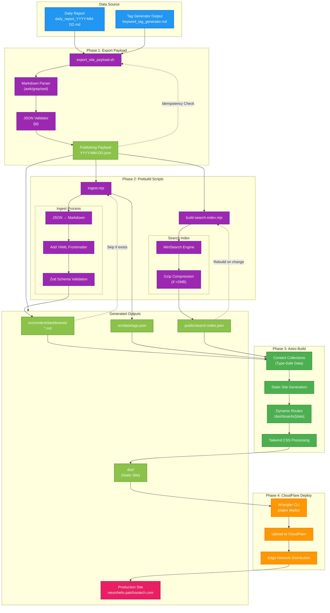

# CloudFlare Pages Publishing Flow

## Overview
This diagram illustrates the complete publishing pipeline for the NeuroHelix static site to CloudFlare Pages. It shows how daily reports are transformed into JSON payloads, ingested into Astro content collections, built into a static site, and deployed to CloudFlare's edge network.

## Diagram

## Key Components

### Phase 1: Export Payload
- **export_site_payload.sh**: Parses daily markdown reports into structured JSON
- Extracts metadata, sections, tags, recommendations, and strategic implications
- Validates JSON output with jq
- Implements idempotency checks to avoid re-processing unchanged reports
- Output: `data/publishing/YYYY-MM-DD.json`

### Phase 2: Prebuild Scripts
- **ingest.mjs**: Converts JSON payloads to Astro content collection format
  - Creates markdown files with YAML frontmatter
  - Validates against Zod schema
  - Aggregates all tags into centralized tags.json
  - Output: `src/content/dashboards/*.md` and `src/data/tags.json`

- **build-search-index.mjs**: Generates client-side search index
  - Uses MiniSearch library for fast client-side search
  - Indexes: date, title, summary, tags, full_text
  - Auto-compresses if index exceeds 2MB
  - Output: `public/search-index.json` (and .gz variant)

### Phase 3: Astro Build
- **Content Collections**: Type-safe data layer with Zod validation
- **Static Site Generation**: Pre-renders all pages at build time
- **Dynamic Routing**: Creates `/dashboards/[date]/` routes
- **Tailwind CSS v4**: Modern utility-first styling
- Output: `dist/` directory with fully static site

### Phase 4: CloudFlare Deployment
- **static_site.sh**: Orchestrates the complete build and deploy process
- **Wrangler CLI**: CloudFlare's official deployment tool
- **Configuration**:
  - Project: `neurohelix-site`
  - Branch: `production`
  - Domain: `neurohelix.patchoutech.com`
- Includes deployment verification and summary JSON generation

## Related Files
- `/scripts/renderers/export_site_payload.sh`: JSON payload exporter
- `/scripts/publish/static_site.sh`: CloudFlare deployment orchestrator
- `/site/package.json`: Build configuration and scripts
- `/site/astro.config.mjs`: Astro framework configuration
- `/site/scripts/ingest.mjs`: Content ingestion script
- `/site/scripts/build-search-index.mjs`: Search index builder
- `/site/src/content/config.ts`: Content collection schema
- `/site/src/pages/index.astro`: Dashboard listing page
- `/site/src/pages/dashboards/[date].astro`: Individual dashboard page
- `/config/env.sh`: CloudFlare project configuration
